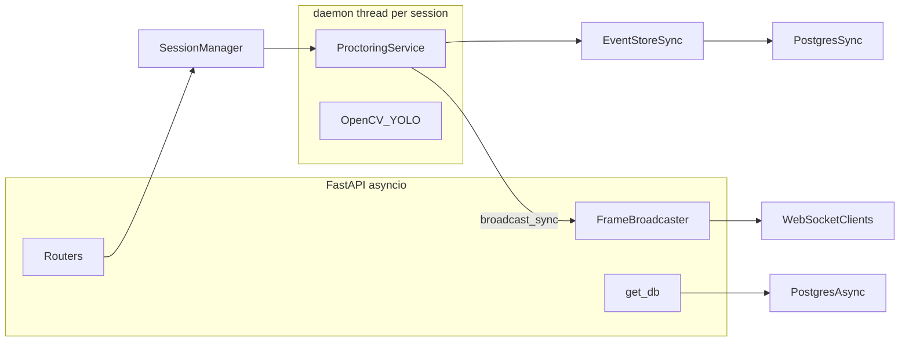

# FastAPI proctoring backend plan

## Blocker resolved: `proctoring.py` import safety

[`backend/proctoring.py`](backend/proctoring.py) currently executes at import time: model I/O, CSV truncation, `VideoCapture`, and a blocking `while True` loop. That makes `import proctoring` from the API unusable.

**Approved approach:** apply a **minimal structural refactor** (same behavior when run as `python proctoring.py`):

- Keep all constants, `CustomCNN`, helpers (`classify_roi`, `get_direction_from_keypoints`, `object_proximity`, `draw_text`, etc.), and `PersonState` at module level.
- Introduce **`load_models(model_dir: str, best_model_file: str) -> None`** that performs what lines 68–96 do today (device, `clf`, `CLF_TRANSFORM`, `yolo`, `pose_yolo`), assigning module-level globals used by `classify_roi` and the loop.
- Move **CSV header creation**, **capture / writer setup**, and the **main loop** under `if __name__ == "__main__":`, calling `load_models(DRIVE_MODELS, BEST_MODEL_FILE)` first, then the existing script body (paths `OUTPUT_DIR`, `LOG_PATH`, `SOURCE`, window, keyboard handling unchanged).

[`backend/proctoring.py`](backend/proctoring.py) is the only pre-existing file you asked not to touch; you explicitly allowed this exception so the service can `sys.path.insert(0, parent)` and `import proctoring` then call `proctoring.load_models(...)` **once** from `ProctoringService.__init__` (see below—not from `_run()`).

## Architecture (high level)

- **API process:** async DB for REST; WebSocket handlers subscribe to `FrameBroadcaster`.
- **CV thread:** blocking OpenCV/PyTorch; pushes frames via **thread-safe** bridge (`asyncio.Queue` on the main loop + `loop.call_soon_threadsafe` to enqueue, or `run_coroutine_threadsafe` for a thin wrapper—prefer **one queue consumer task** started in lifespan to avoid per-frame `run_coroutine_threadsafe` overhead).
- **Events:** `save_event_sync` uses a **sync** `create_engine(..., pool_size=3, max_overflow=2)` + `sessionmaker` with a **new sync `Session` per call** from the worker thread (pool sized to avoid exhaustion at high event rates). REST list/summary use **async** sessions from [`core/database.py`](backend/core/database.py). **Only CHEATING verdicts** invoke `save_event_sync` (matches original `log_event` behavior).

## Database layer

- **ORM** in [`backend/models/db_models.py`](backend/models/db_models.py):
  - **UUID PKs (Python defaults only):** `import uuid` and `mapped_column(Uuid, primary_key=True, default=uuid.uuid4)` on both `ExamSession` and `ProctoringEvent`. **Do not** use `server_default=gen_random_uuid()`—no `pgcrypto` extension required.
  - `ExamSession`: columns per spec; `metadata` column: map Python attribute to a **non-reserved** name (e.g. `extra_metadata`) with `mapped_column("metadata", JSONB)` to avoid clashing with `Base.metadata`.
  - `ProctoringEvent`: FK `session_id` → `exam_sessions.id` `ondelete="CASCADE"`, `reasons` as `ARRAY(Text)` or `ARRAY(String)`.
  - **Indexes:** composite `(session_id, occurred_at.desc())`; partial index on `(session_id, verdict)` with `postgresql_where=(column.verdict == 'CHEATING')` (match spec string `CHEATING`).
- **Enums** in [`backend/models/enums.py`](backend/models/enums.py): `SessionStatus`, `VerdictEnum` (strings aligned with DB/VARCHAR).
- **Pydantic** in [`backend/models/schemas.py`](backend/models/schemas.py): exactly the models listed in the prompt (`SessionCreate`, `SessionResponse`, `EventResponse`, `EventsPage`, `EventSummary`, `FramePayload`, `PersonFrame`).

## Core modules

- [`backend/core/config.py`](backend/core/config.py): `pydantic-settings` `BaseSettings` with the fields you specified; load `.env`.
- [`backend/core/database.py`](backend/core/database.py): `async_engine`, `async_sessionmaker`, `get_db` dependency, `Base` import from `models.db_models` (or single `Base` in `db_models` and imported here—**one `Base`** only).
- [`backend/core/dependencies.py`](backend/core/dependencies.py): `get_settings`, optional `get_session_manager` singleton wiring if you want clean tests.

## Services

### [`backend/services/event_store.py`](backend/services/event_store.py)

- **Sync engine:** `create_engine(settings.SYNC_DATABASE_URL, pool_size=3, max_overflow=2)` (module-level or lazy singleton); `sessionmaker` for sync sessions.
- **`save_event_sync(session_id, event_data, log_csv_path)`** (or resolve path from DB): **mandatory** flow: (1) `INSERT` into `proctoring_events` with commit/rollback in `try/except`; (2) **append one CSV row** via `open(log_csv_path, "a", newline="")` and `csv.writer` (same columns as legacy script: timestamp, person_id, verdict, cheat_prob, direction, obj_nearby, obj_name, reasons). Called **only for CHEATING verdicts** (aligned with original `log_event` / no DB+CSV spam on OK frames).
- **CSV header:** write header row once when the session **starts** (same moment `exam_sessions.log_csv` is set—see Output paths), before any events, so the first append is valid.
- **`async get_events(...)`** with filters (`verdict`, `person_id`, `from_ts`, `to_ts`, limit capped at 500, offset) + `count()` for `total`.
- **Summary:** SQL aggregates + Python for `timeline` (bucket `occurred_at` into 1-minute windows, counts cheating vs ok per bucket). Direction keys: normalize to string (e.g. `LEFT`, `GAZE LEFT` as stored).

### [`backend/services/frame_broadcaster.py`](backend/services/frame_broadcaster.py)

- `_subscribers: dict[str, set[WebSocket]]`
- `subscribe` / `unsubscribe` (async; unsubscribe in `finally` on WS disconnect).
- **`broadcast_sync`:** thread-safe enqueue to `asyncio.Queue` bound to the **main app loop** captured at startup; a **lifespan-started asyncio task** drains the queue and calls `await broadcast(session_id, payload)` which iterates subscribers and `send_json` with exception handling per socket (drop dead sockets).
- **`ping` → `pong`** handled in [`backend/routers/stream.py`](backend/routers/stream.py).

### [`backend/services/proctoring_service.py`](backend/services/proctoring_service.py)

- `sys.path.insert(0, str(Path(__file__).resolve().parent.parent))` then `import proctoring`.
- **`ProctoringService.__init__`:** call **`proctoring.load_models(model_dir, best_model_file)` here** so YOLO + CNN load **once per service instance** (not inside `_run()`). Re-starting the same session’s thread must **not** reload weights—achieve this by **reusing the same `ProctoringService` instance** across `stop()` → `start()` for that `session_id` (see `SessionManager` below); only construct a new service when the session is first started or after hard delete / explicit replacement.
- **Ctor args:** `session_id`, `source` (int if source string `"0"` else path string), `model_dir`, `best_model_file`, `event_store`, `frame_broadcaster`, `log_csv_path`, `output_video_path`, `jpeg_quality` (paths known at construction or set before first `start()`).
- **`start()`:** daemon `threading.Thread` running `_run` only (no model load).
- **`_run()`:** adapt the **main loop** from `proctoring.py` with these deltas:
  - **No** `cv2.imshow` / `cv2.waitKey` in server mode (headless); still write `annotated.avi` and track FPS.
  - Per-frame: build `PersonFrame` list (bbox, verdict `CHEATING|OK`, `cheat_prob`, direction, obj fields, reasons); JPEG-encode annotated frame with `cv2.imencode` + quality from `WS_FRAME_JPEG_QUALITY`; call `frame_broadcaster.broadcast_sync(...)`.
  - **CHEATING only:** where the original calls `log_event`, call `event_store.save_event_sync(...)` (DB insert + CSV append). OK verdicts do not call `save_event_sync`.
  - Respect `_stop_event` between frames and on stream end; on exit update DB fields used by `stop()` API (see sessions router).
- **`stop()`:** set event, `join(timeout=5)`.

### [`backend/services/session_manager.py`](backend/services/session_manager.py)

- In-memory `dict[str, ProctoringService]`; `get`, `start`, `stop`, `list_running()`.
- **`start(session_id, ...)`:** if no service exists for `session_id`, construct `ProctoringService` (loads models in `__init__`). If a service **already exists** after a prior `stop()`, call `service.start()` again **without** re-instantiating (preserves loaded models).
- Optionally remove mapping only on `DELETE /sessions/{id}` or explicit cleanup.

## Routers

- [`backend/routers/sessions.py`](backend/routers/sessions.py) prefix `/sessions` (mounted under `/api/v1`): CRUD + start/stop per spec; **409** if start when running or stop when not running; **404** missing session; **DELETE 204** only if `status != running` (and not `running`—clarify: treat `error` as deletable).
- [`backend/routers/events.py`](backend/routers/events.py) prefix `/sessions` nested routes: list, summary, **`GET .../export`:** return the **on-disk CSV** at `exam_sessions.log_csv` via `FileResponse` + `Content-Disposition: attachment; filename="session_{id}_events.csv"` — **no** CSV generation from DB.
- [`backend/routers/stream.py`](backend/routers/stream.py) — **`WebSocket` `/ws/{session_id}` connect behavior:**
  - **(a)** Load `exam_sessions` row by `session_id` from the DB (async session).
  - **(b)** If not found: `close(code=1008)` (policy violation / invalid session).
  - **(c)** If `status` is `idle`, `stopped`, or `error`: send `{"type":"status","status":<current_db_status>,"message":...}` (message optional but useful), then **`close(code=1000)`** normal closure—do **not** subscribe or leave the socket open.
  - **(d)** If `status` is `running`: subscribe to `FrameBroadcaster`, then run the receive loop (`ping` → `pong`, disconnect → unsubscribe in `finally`).
- [`backend/routers/health.py`](backend/routers/health.py): `GET /health` async DB ping → `"connected"` / `"error"`.

## [`backend/main.py`](backend/main.py)

- `FastAPI(title="Proctoring API", version="1.0.0")`.
- CORS from `settings.CORS_ORIGINS` (default `["*"]`), `allow_methods=["*"]`, `allow_headers=["*"]`.
- **Lifespan:** startup `create_all` for dev convenience + start frame-queue consumer task + log; shutdown: **stop all** `SessionManager` active threads, cancel consumer.
- Include routers: `sessions`, `events` with prefix `/api/v1`; `stream` and `health` without prefix.
- **Global 500 handler:** JSON `{"error":"internal_server_error","detail": str(exc)}` (avoid leaking stack in production later—fine per spec).

## Alembic

- [`backend/alembic.ini`](backend/alembic.ini) + [`backend/alembic/env.py`](backend/alembic/env.py): `SYNC_DATABASE_URL` from settings; `target_metadata = Base.metadata`; **`versions/` empty**—no initial migration committed.
- Autogenerated migrations should create UUID columns **without** server defaults, matching ORM `default=uuid.uuid4` (application supplies IDs on insert).
- Document first-run commands (printed in final summary for the user).

## Docker / deps / env

- [`backend/requirements.txt`](backend/requirements.txt): exact list from prompt.
- [`backend/.env`](backend/.env): template keys only (no real secrets beyond local dev placeholders matching docker-compose).
- [`backend/Dockerfile`](backend/Dockerfile): as specified (`libgl1`, `libglib2.0-0`).

**Note:** [`backend/docker-compose.yml`](backend/docker-compose.yml) is **not** modified per instructions.

## Output paths and stop/start DB updates

- On **start:** create `backend/proctoring_runs/{session_id}/` (path relative to repo root / app cwd as agreed in implementation). Set **`exam_sessions.log_csv`** to exactly **`backend/proctoring_runs/{session_id}/events.csv`** (string stored in DB; ensure directory exists). Write **CSV header row** once to that file when the session transitions to `running`. Set **`output_video`** to e.g. `backend/proctoring_runs/{session_id}/annotated.avi` (same pattern). `ProctoringService` uses these paths for `VideoWriter` and passes `log_csv` into `save_event_sync` for every **CHEATING** event append.
- On **stop:** join thread; set `stopped_at`, `status=stopped`; paths already set at start. On pipeline error set `status=error`, push WS `status` if any subscribers (running case); clients connecting while `error` get (c) behavior above.

## Testing mindset (manual first)

- After implementation: `docker compose up -d` in `backend/`, run Alembic, `uvicorn main:app --reload --port 8000` from `backend/`.
- Smoke: `POST /api/v1/sessions`, `POST .../start` with `source` as a short mp4 path (no GUI), WS subscribe, `GET /events`, `stop`, `export`.

## Deliverable summary (post-implementation)

You asked for a printed block listing: all file paths created, DB compose command, Alembic commands, uvicorn command, and full endpoint list—that will be included in the implementation completion message (not in this plan file).
