# AI Classroom Cheating Detection System — Full Architecture

**Helwan National University | Neural Networks & Deep Learning**

---

## Table of Contents

1. [Project Overview](#1-project-overview)
2. [High-Level System Architecture](#2-high-level-system-architecture)
3. [Data Pipeline (Notebooks 01–02)](#3-data-pipeline-notebooks-0102)
4. [Model Training Architecture (Notebooks 03.1–03.4)](#4-model-training-architecture)
5. [Custom CNN Architecture (Winner)](#5-custom-cnn-architecture-winner)
6. [Model Comparison Results (Notebook 04)](#6-model-comparison-results)
7. [Backend Architecture (FastAPI)](#7-backend-architecture-fastapi)
8. [Real-Time Proctoring Pipeline](#8-real-time-proctoring-pipeline)
9. [Frontend Architecture (Next.js)](#9-frontend-architecture-nextjs)
10. [Frontend User Flows](#10-frontend-user-flows)
11. [Database Schema](#11-database-schema)
12. [WebSocket Protocol](#12-websocket-protocol)
13. [Full Request Flow: Image Upload](#13-full-request-flow-image-upload)
14. [Full Request Flow: Live Session](#14-full-request-flow-live-session)
15. [Decision Engine Logic](#15-decision-engine-logic)
16. [Technology Stack Summary](#16-technology-stack-summary)

---

## 1. Project Overview

The system detects exam cheating in real time using a three-track computer vision pipeline:

- **Track 1 — Object Detection:** YOLOv8n identifies persons and suspicious objects (phone, laptop, book, notebook)
- **Track 2 — Pose Analysis:** YOLOv8n-pose computes head turn direction and gaze using 17 body keypoints
- **Track 3 — CNN Classification:** Custom CNN classifies each person's bounding-box crop as *cheating* or *not_cheating*

All three verdicts feed into a per-person decision engine that emits a final `CHEATING` or `OK` verdict per frame, streamed live to the dashboard over WebSocket.

---

## 2. High-Level System Architecture

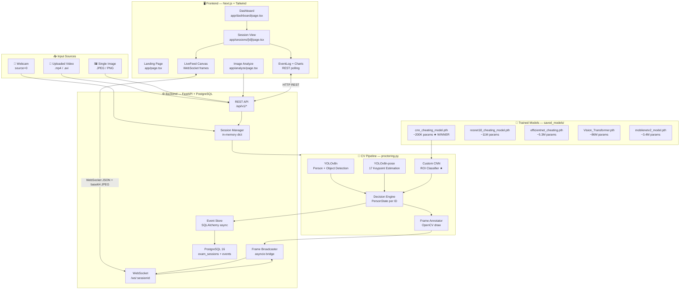

---

## 3. Data Pipeline (Notebooks 01–02)

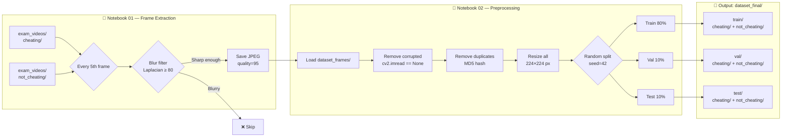

**Key parameters:**
| Setting | Value |
|---------|-------|
| Frame skip interval | Every 5th frame |
| Blur threshold (Laplacian variance) | ≥ 80 |
| JPEG quality | 95 |
| Image size | 224 × 224 px |
| Train / Val / Test split | 80% / 10% / 10% |
| Random seed | 42 (reproducible) |
| Classes | `cheating`, `not_cheating` |

---

## 4. Model Training Architecture

All five models share the same training loop and evaluation harness. Differences are in architecture, normalization, and fine-tuning strategy.

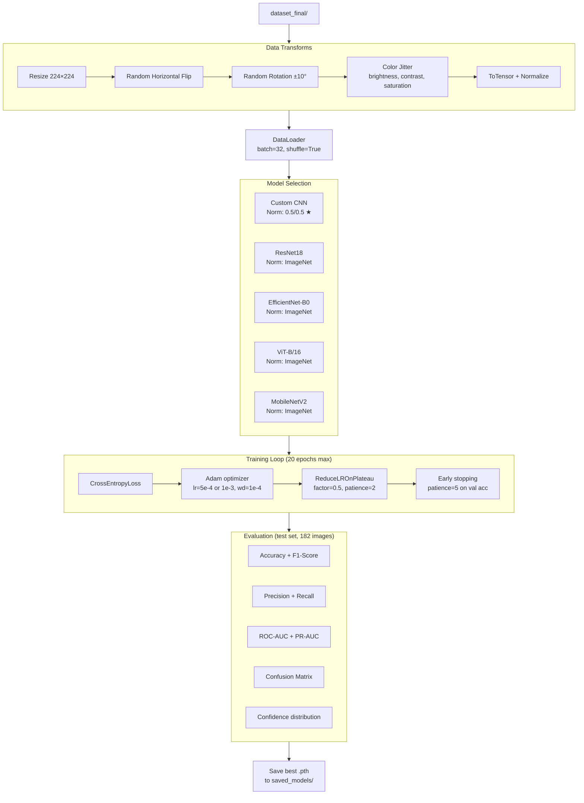

**Fine-tuning strategies:**

| Model | Strategy |
|-------|----------|
| Custom CNN | Trained from scratch — all layers |
| ResNet18 | Freeze backbone → train FC head → optional full unfreeze |
| EfficientNet-B0 | Freeze features → train classifier → optional full fine-tune |
| ViT-B/16 | Freeze encoder → train head → optional unfreeze last 4 blocks |
| MobileNetV2 | Freeze features → train classifier → optional full fine-tune |

---

## 5. Custom CNN Architecture (Winner)

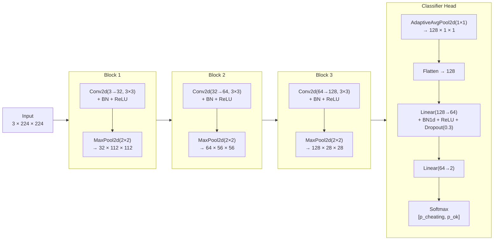

**Why Custom CNN won:** Same 97.80% accuracy as models 200–430× larger. ~200K parameters enable real-time inference with negligible GPU load. ROC-AUC of 99.95% on the test set.

---

## 6. Model Comparison Results

*(Test set: 182 images — held-out, never seen during training)*

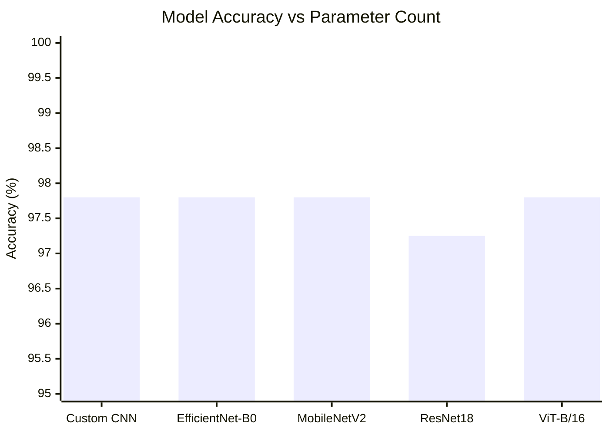

| Model | Accuracy | Precision | Recall | F1-Score | ROC-AUC | Params |
|-------|----------|-----------|--------|----------|---------|--------|
| **Custom CNN ⭐** | **97.80%** | **97.87%** | **97.83%** | **97.80%** | **99.95%** | **~200K** |
| EfficientNet-B0 | 97.80% | 97.87% | 97.83% | 97.80% | 99.89% | ~5.3M |
| ViT-B/16 | 97.80% | 97.87% | 97.83% | 97.80% | 99.99% | ~86M |
| MobileNetV2 | 97.80% | 97.81% | 97.81% | 97.80% | 99.43% | ~3.4M |
| ResNet18 | 97.25% | 97.25% | 97.25% | 97.25% | 99.86% | ~11M |

> Custom CNN is **430× smaller than ViT** while achieving equivalent accuracy — the clear choice for real-time edge deployment.

---

## 7. Backend Architecture (FastAPI)

> **Note:** Mermaid treats `{` inside node labels as rhombus syntax. Path placeholders use `:id` / `:sessionId` (same meaning as `{id}` in OpenAPI).

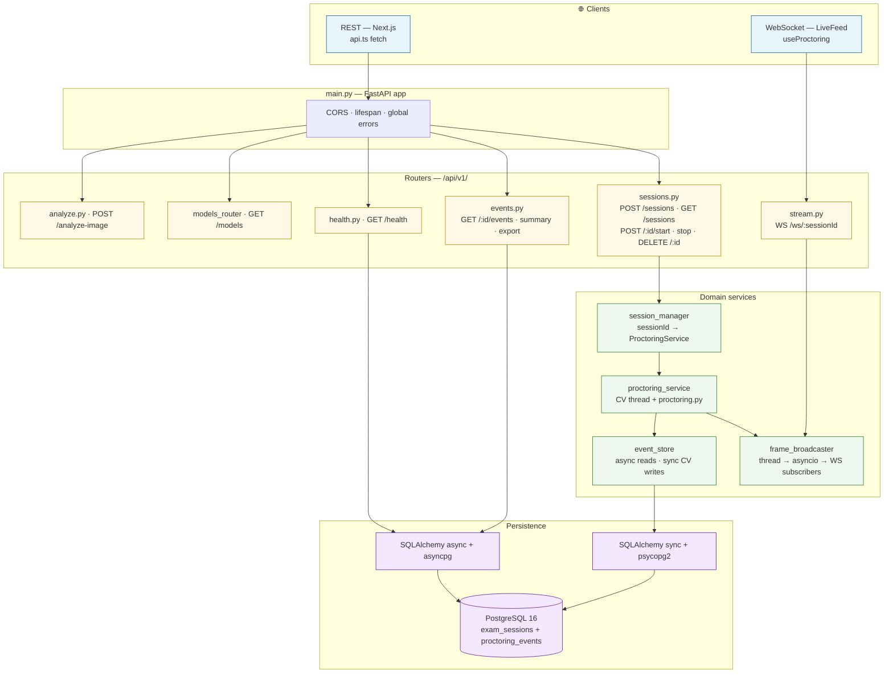

**Layer cheat sheet (for demos):** clients → FastAPI shell → thin routers → long‑running services → two DB access paths (async API vs sync CV thread).

---

## 8. Real-Time Proctoring Pipeline

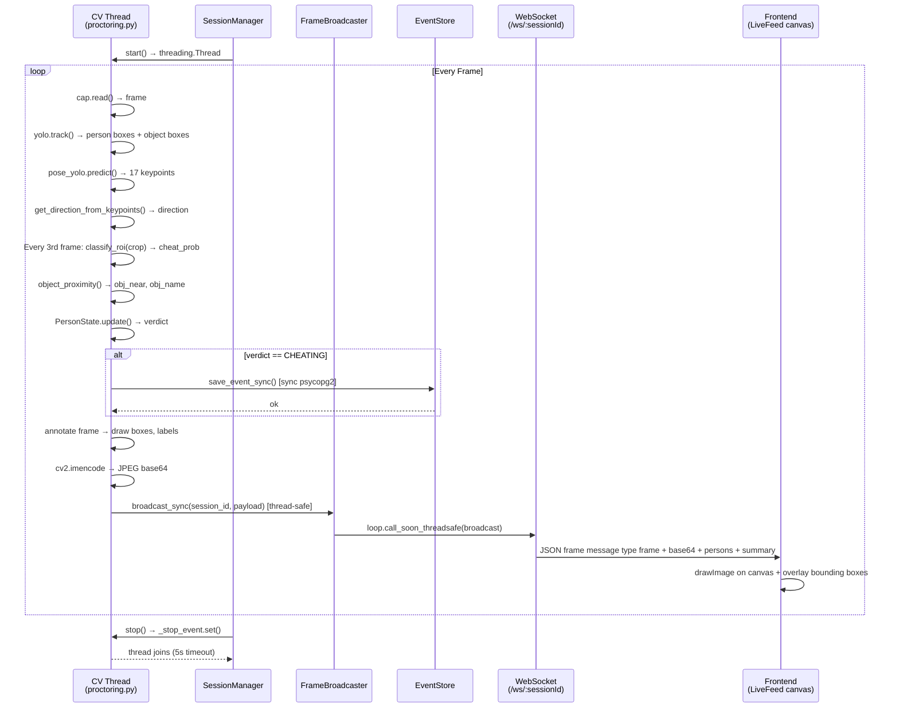

---

## 9. Frontend Architecture (Next.js)

```mermaid
graph TD
    subgraph PAGES["Pages / Routes"]
        PG1["/ — Landing Page<br/>app/page.tsx"]
        PG2["/dashboard — Session List<br/>app/dashboard/page.tsx"]
        PG3["/sessions/[id] — Live View<br/>app/sessions/[id]/page.tsx"]
        PG4["/analyze — Image Analysis<br/>app/analyze/page.tsx"]
    end

    subgraph HOOKS["lib/hooks/"]
        H1[useSessions.ts<br/>CRUD + 10s polling]
        H2[useSession.ts<br/>Single session + start/stop]
        H3[useProctoring.ts<br/>WebSocket + frame state<br/>reconnect backoff]
        H4[useEvents.ts<br/>Events + summary + export]
    end

    subgraph COMPONENTS["components/proctoring/"]
        C1[LiveFeed.tsx<br/>canvas renderer<br/>requestAnimationFrame]
        C2[PersonOverlay.tsx<br/>bbox + verdict badge]
        C3[EventLog.tsx<br/>real-time scrolling table]
        C4[StatsPanel.tsx<br/>FPS / persons / alerts]
        C5[SummaryCharts.tsx<br/>timeline + heatmap + confidence]
        C6[SessionCard.tsx<br/>status + start/stop]
        C7[CreateSessionModal.tsx<br/>form + ModelSelector]
        C8[ModelSelector.tsx<br/>GET /api/v1/models]
        C9[UploadVideoModal.tsx<br/>drag-and-drop upload]
    end

    subgraph LIB["lib/"]
        L1[api.ts<br/>all fetch wrappers]
        L2[types.ts<br/>all TypeScript types]
        L3[backend.ts<br/>base URL config]
    end

    PG2 --> H1 --> C6
    PG2 --> C7
    PG3 --> H2
    PG3 --> H3 --> C1
    PG3 --> H4 --> C3
    PG3 --> C4
    PG3 --> C5
    PG4 --> L1
    PG4 --> C8
    C7 --> C8
    L1 --> L3
    L1 --> L2
    H3 --> C4
```

---

## 10. Frontend User Flows

### Flow A — Start a Live Session

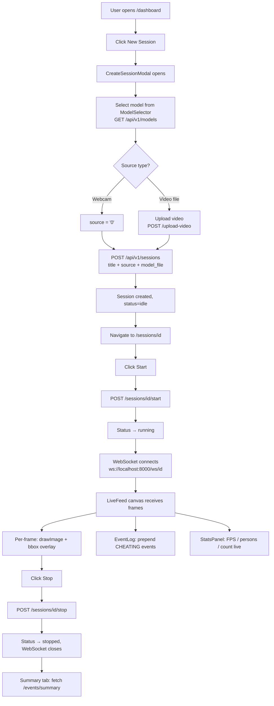

### Flow B — Analyze a Single Image

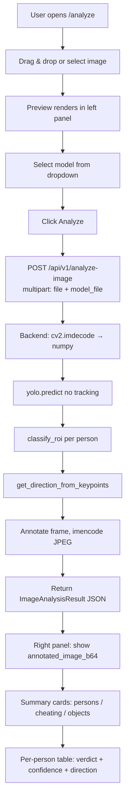

---

## 11. Database Schema

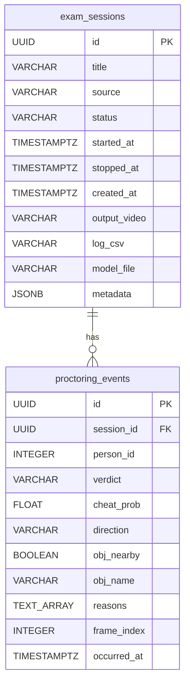

**Indexes:**
- `proctoring_events(session_id, occurred_at DESC)` — timeline queries
- `proctoring_events(session_id, verdict) WHERE verdict = 'CHEATING'` — partial index for fast cheating counts

---

## 12. WebSocket Protocol

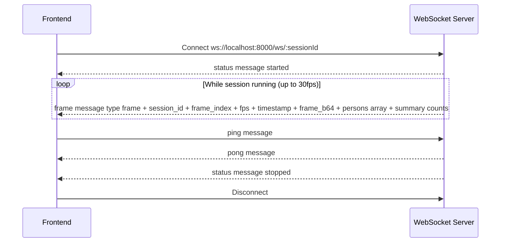

**Frame JSON shape (reference):** `type`, `session_id`, `frame_index`, `fps`, `timestamp`, `frame_b64`, `persons[]` (each with `id`, `verdict`, `cheat_prob`, `direction`, `obj_nearby`, `obj_name`, `reasons`, `bbox`), `summary` (`person_count`, `cheating_count`).

**Reconnect strategy (frontend `useProctoring.ts`):**

| Attempt | Delay |
|---------|-------|
| 1 | 1 s |
| 2 | 2 s |
| 3 | 4 s |
| 4 | 8 s |
| 5 | 16 s |
| > 5 | Give up, show error |

---

## 13. Full Request Flow: Image Upload

```mermaid
flowchart LR
    A[User selects image<br/>in browser] -->|multipart/form-data| B[POST /api/v1/analyze-image]
    B --> C[FastAPI reads file bytes]
    C --> D[cv2.imdecode → numpy array]
    D --> E[load_models if not cached]
    E --> F[yolo.predict<br/>no tracking, conf=0.5]
    F --> G[For each person bbox<br/>extract ROI crop]
    G --> H[classify_roi<br/>→ cheat_prob, verdict]
    H --> I[pose_yolo.predict<br/>→ 17 keypoints]
    I --> J[get_direction_from_keypoints<br/>→ direction string]
    J --> K[object_proximity check<br/>→ obj_near, obj_name]
    K --> L[Draw annotated frame<br/>RED boxes = CHEATING<br/>GREEN boxes = OK]
    L --> M[cv2.imencode JPEG<br/>→ base64 string]
    M --> N[Return ImageAnalysisResult JSON]
    N --> O[Frontend renders<br/>annotated image + table]
```

---

## 14. Full Request Flow: Live Session

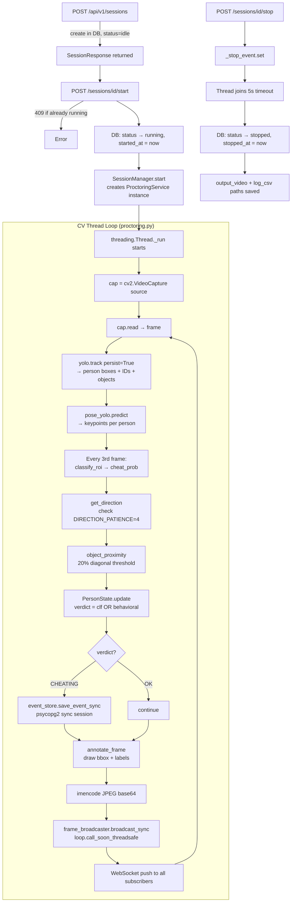

---

## 15. Decision Engine Logic

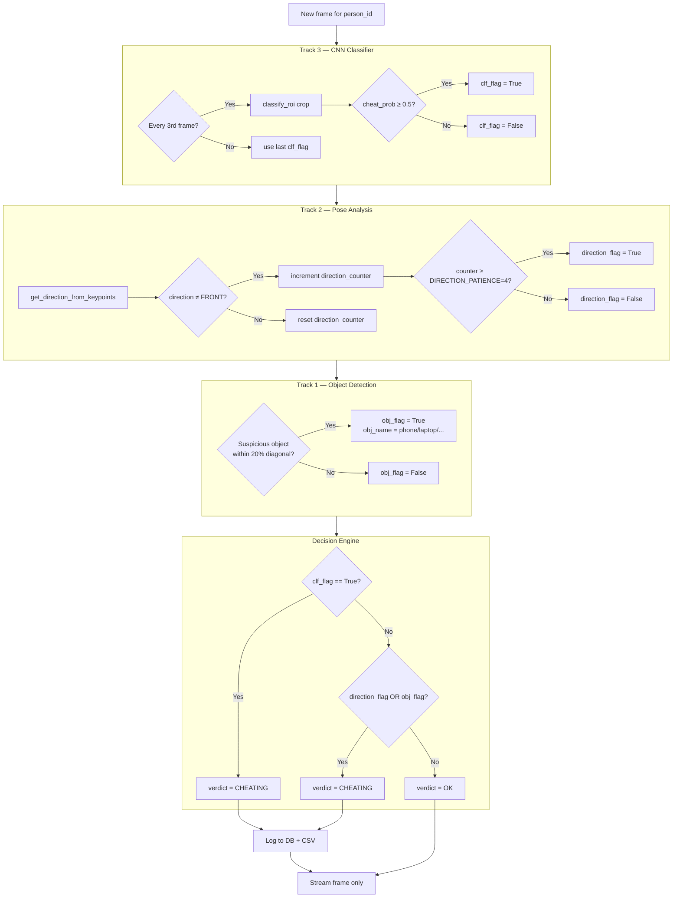

---

## 16. Technology Stack Summary

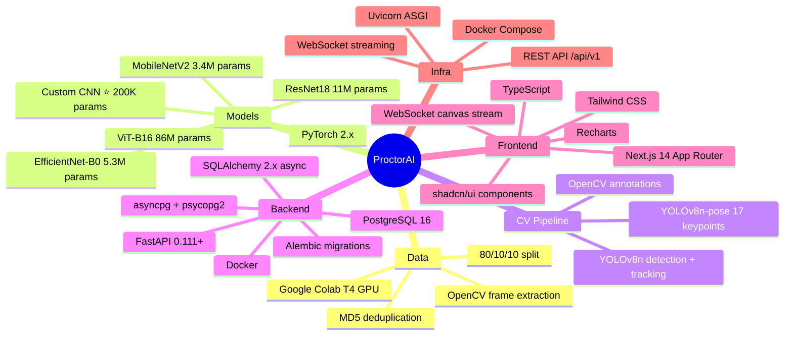

---

### Key Design Decisions

| Decision | Rationale |
|----------|-----------|
| Custom CNN as production model | Same accuracy as ViT at 430× fewer parameters — critical for real-time inference |
| Threading for CV loop (not async) | OpenCV and PyTorch blocking calls are incompatible with asyncio event loop |
| Dual DB sessions (sync + async) | CV thread needs synchronous psycopg2 writes; REST routes use async asyncpg |
| `loop.call_soon_threadsafe` bridge | Thread-safe way to push frames from blocking CV thread into async WebSocket |
| Per-person `PersonState` | YOLO tracking IDs persist across frames — each person has independent timers and history |
| `DIRECTION_PATIENCE = 4` | Prevents false positives from momentary head movements; requires 4 consecutive off-center frames |
| Classify every 3rd frame | Balances accuracy with latency — CNN inference is the most expensive step per person |
| base64 JPEG over WebSocket | Avoids binary framing complexity; quality set to 60 to balance bandwidth vs. visual clarity |
